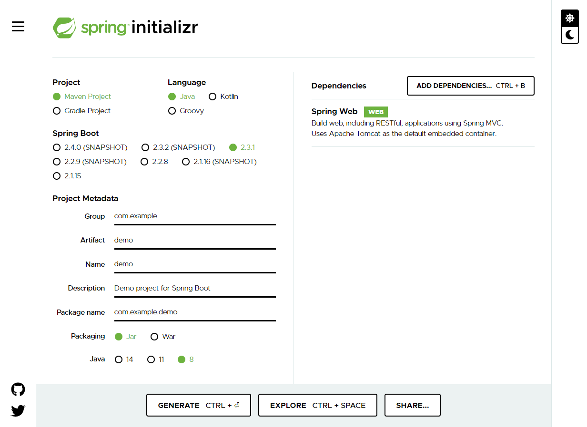
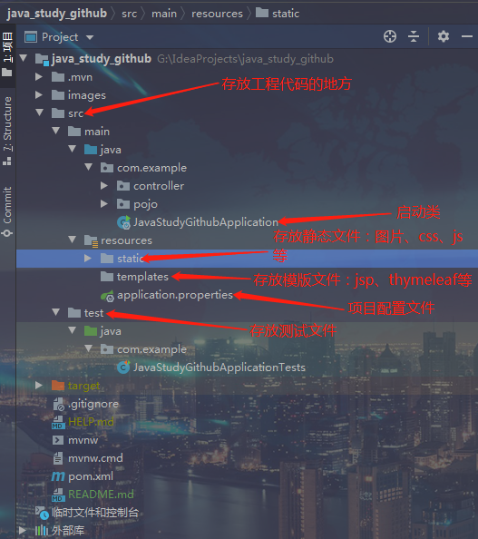
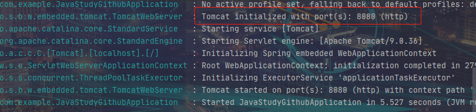
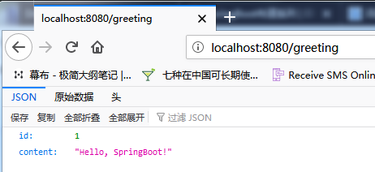
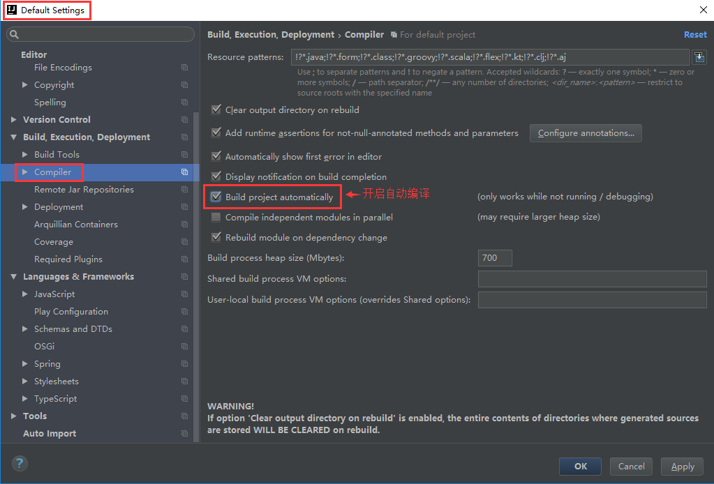
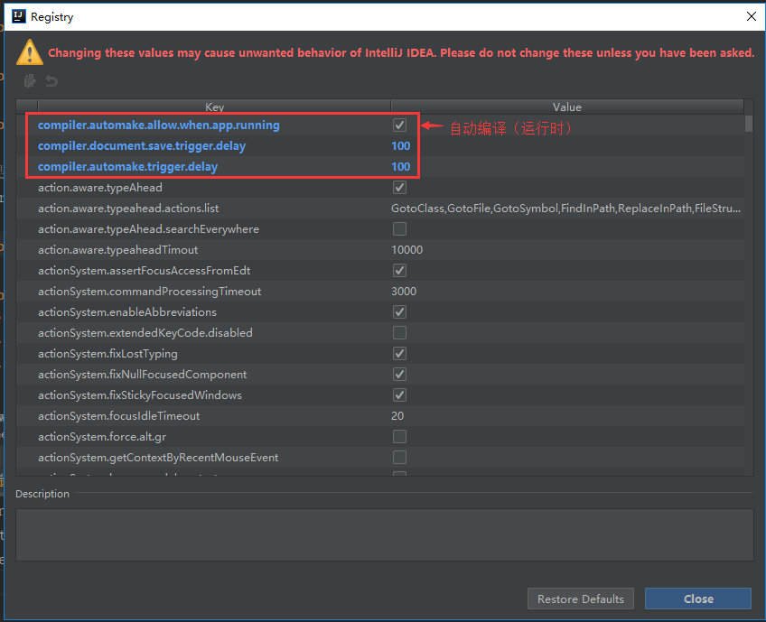
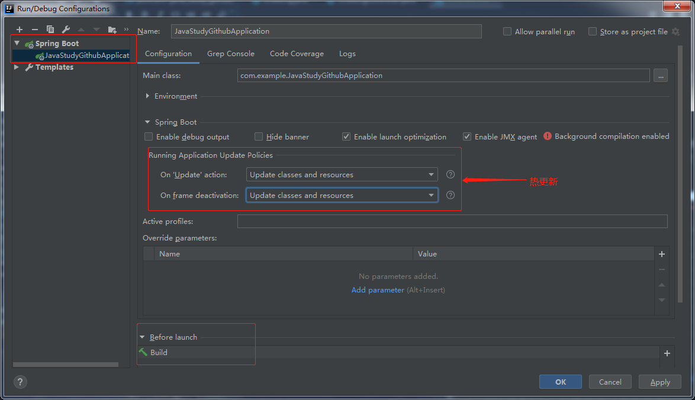
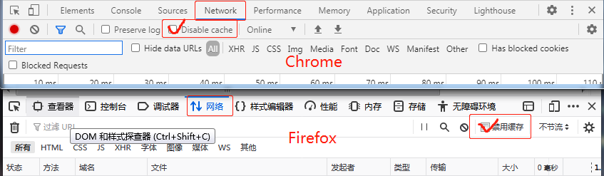

## SpringBoot 快速入门
> 前言：SpringBoot是在Spring的基础上实现自动配置的基础框架，快速帮助Spring整合各种第三方框架，让项目配置化繁为简，大大提高了开发的效率。
## 一、SpringBoot解决的问题
    1. 使编码变得简单
    2. 使配置变得简单
    3. 使部署变得简单
    4. 使监控变得简单
## 二、SpringBoot主要特性
    1. 遵循习惯优于配置的原则。使用springboot我们只需要很少的
    2. 项目快速搭建。springboot帮助开发者快速搭建spring框架，可无需配置的自动整合第三方框架
    3. 可以完全不使用xml配置，只需要自动配置和Java config
    4. 内嵌servlet容器，降低了对环境的要求，可用命令直接执行项目
    5. 提供了starter POM，能够非常方便的进行包管理
    6. 对主流框架无配置集成
    7. 与云计算天然集成
## 三、springboot的核心功能
    1. 独立运行spring项目。springboot可以以jar包的形式进行独立运行，使用java -jar xx.jar 就可以成功运行项目。
    2. 内嵌servlet容器。内嵌容器，使得我们可以执行运行项目的主程序main函数，使得项目可以快速运行。
    3. 提供starter简化Maven配置。springboot提供了一系列的start pol用来简化maven依赖。如：常用的spring-boot-starter-web、spring-boot-starter-tomcat、spring-boot-starter-actuator等
    4. 自动配置spring。springboot会根据我们项目中类路径的jar包，为jar包的类进行自动装配bean。
    5. 应用监控。springboot提供了基于HTTP、ssh、telnet对运行时的项目进行监控。
    springboot提供了actuator组件，只需要在配置中加入spring-boot-starter-actuator依赖，通过继承AbstractHealthIndicator这个抽象类，然后在doHealthCheck()方法中检测服务健康的方法，就可以实现一个简单的监控。
    具体可参考该博客：https://www.jianshu.com/p/41c1026f2c9d
## 四、springboot的缺点
    1. 高度集成，使用的时候不知道底层实现
    2. 由于不了解底层，导致项目出了问题会很难排查
## 五、SpringBoot快速入门
#### 1、搭建开发环境
- JDK版本：[Oracle JDK 1.8+](https://java.com/zh_CN/download/)
- 构建工具：[Apache Maven 3.6.1+(bin.zip)](http://maven.apache.org/download.cgi)
- 开发工具：[IntelliJ IDEA 2020.1.2](https://www.jetbrains.com/idea/download/#section=windows) |
          [Eclipse IDE 2020-06](https://www.eclipse.org/downloads/)
 #### 2、创建第一个工程
 
**新建 Spring Boot 项目常用的两种方式**

 1、可以通过[https://start.spring.io/](https://start.spring.io/) 这个网站生成一个SpringBoot项目。
 


注意选上Spring Web这个模块，这是我们所必需的一个依赖。当所有选项都勾选完毕之后，点击下方的按钮 Generate 下载这个 Spring Boot 的项目。下载完成并解压之后，我们直接使用 IDEA 打开即可。

2、你也可以直接通过 IDEA 来生成一个 Spring Boot 的项目，具体方法和上面类似：File->New->Project->Spring Initializr。

**Spring Boot 项目结构分析**

成功打开项目之后，如下图：



以Application结尾的Java类一般就是SpringBoot的启动类，比如本项目的启动类就是JavaStudyGithubApplication。
我们直接像运行普通Java程序一样运行它，由于 Spring Boot 本身就嵌入servlet容器的缘故，我们的 web 项目就运行成功了， 非常方便。

需要注意的一点是 Spring Boot 的启动类是需要最外层的，不然可能导致一些类无法被正确扫描到，导致一些奇怪的问题。 一般情况下 Spring Boot 项目结构类似下面这样

    com
      +- example
        +- myproject
          +- Application.java
          |
          +- domain
          |  +- Customer.java
          |  +- CustomerRepository.java
          |
          +- service
          |  +- CustomerService.java
          |
          +- controller
          |  +- CustomerController.java
          |  
          | +- config
          |  +- swagerConfig.java
          |
1. Application.java是项目的启动类
2. domain目录主要用于实体（Entity）与数据访问层（Repository）
3. service 层主要是业务类代码
4. controller 负责页面访问控制
5. config 目录主要放一些配置类

**@SpringBootApplication 注解分析**

JavaStudyGithubApplication
```java
@SpringBootApplication
public class JavaStudyGithubApplication {

	public static void main(String[] args) {
		SpringApplication.run(JavaStudyGithubApplication.class, args);
	}

}
```
说到 Spring Boot 启动类就不得不介绍一下 @SpringBootApplication 注解了，这个注解的相关代码如下：
```java
@Target(ElementType.TYPE)
@Retention(RetentionPolicy.RUNTIME)
@Documented
@Inherited
@SpringBootConfiguration
@EnableAutoConfiguration
@ComponentScan(excludeFilters = { @Filter(type = FilterType.CUSTOM, classes = TypeExcludeFilter.class),
		@Filter(type = FilterType.CUSTOM, classes = AutoConfigurationExcludeFilter.class) })
public @interface SpringBootApplication {
    
}
```
```java
@Target(ElementType.TYPE)
@Retention(RetentionPolicy.RUNTIME)
@Documented
@Configuration
public @interface SpringBootConfiguration {
    
}
```
可以看出大概可以把 @SpringBootApplication看作是 @Configuration、@EnableAutoConfiguration、@ComponentScan 注解的集合。根据 SpringBoot官网，这三个注解的作用分别是：
- @EnableAutoConfiguration：启用 SpringBoot 的自动配置机制
- @ComponentScan： 扫描被@Component (@Service,@Controller)注解的bean，注解默认会扫描该类所在的包下所有的类。
- @Configuration：允许在上下文中注册额外的bean或导入其他配置类。

所以说 @SpringBootApplication就是几个重要的注解的组合，为什么要有它？当然是为了省事，避免了我们每次开发 Spring Boot 项目都要写一些必备的注解。这一点在我们平时开发中也经常用到，比如我们通常会提一个测试基类，这个基类包含了我们写测试所需要的一些基本的注解和一些依赖。

**新建一个 Controller**

在com.example目录新建一个controller包，并在这个包下面创建一个名字叫做Greetingcontroller的类。

完整包名：com.example.controller
```java
package com.example.controller;

import com.example.pojo.Greeting;
import org.springframework.web.bind.annotation.GetMapping;
import org.springframework.web.bind.annotation.RequestParam;
import org.springframework.web.bind.annotation.RestController;

import java.util.concurrent.atomic.AtomicLong;

@RestController
public class Greetingcontroller {

    private static final String TEMPLATE = "Hello, %s!";
    private final AtomicLong COUNTER = new AtomicLong();
    
    @GetMapping("/greeting")
    public Greeting greeting(@RequestParam(value = "name",defaultValue = "SpringBoot")String name){
        return new Greeting(COUNTER.incrementAndGet(),String.format(TEMPLATE,name));
    }
}
```
@RestController是Spring 4 之后新加的注解，如果在Spring4之前开发 RESTful Web服务的话，你需要使用@Controller 并结合@ResponseBody注解，也就是说@Controller +@ResponseBody= @RestController。

**配置端口号**
默认情况下，Spring Boot 项目会使用 8080 作为项目的端口号。如果我们修改端口号的话，非常简单，直接修改application.properties配置文件即可。

src/main/resources/application.properties
```properties
server.port=8333
```
**运行项目**

运行JavaStudyGithubApplication，查看控制台如下：



在浏览器访问： [http://localhost:8080/greeting](http://localhost:8080/greeting) ,返回结果如图：



## SpringBoot在IDEA中实现热部署
> 热部署就是当应用程序正在运行的时候升级软件或修改某一部分代码、配置文件时，无需重新启动应用，即可使升级的软件和修改后的代码、配置文件生效。
### 具体步骤：
#### 一、开启IDEA的自动编译（静态）
>File -> Settings -> Default Settings -> Build -> Compiler 然后勾选 Build project automatically 。



#### 二、开启IDEA的自动编译（动态）
>同时按住 Ctrl + Shift + Alt + / 然后进入Registry ，勾选自动编译并调整延时参数。
- compiler.automake.allow.when.app.running -> 自动编译
- compile.document.save.trigger.delay -> 自动更新文件

compile.document.save.trigger.delay主要是针对静态文件如JS CSS的更新，将延迟时间减少后，直接按F5刷新页面就能看到效果！



#### 三、开启IDEA的热部署策略（非常重要）
> Run -> Edit Configurations插件->目标项目->勾选热更新。
>


#### 四、在项目添加热部署插件（可选）
> 在POM文件添加热部署插件
```xml
   <dependency>
        <groupId>org.springframework.boot</groupId>
        <artifactId>spring-boot-devtools</artifactId>
        <optional>true</optional>
        <scope>runtime</scope>
    </dependency>
```
>PS： 
>也可以不使用spring-boot-devtools依赖，直接按Ctrl+Shift+F9进行手动免启动快速更新
#### 五、关闭浏览器缓存（重要）
浏览器中打开调试模式（F12），选择Network（网络），然后勾选Disable cache（禁用缓存）。



